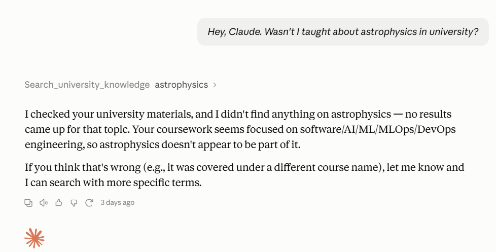
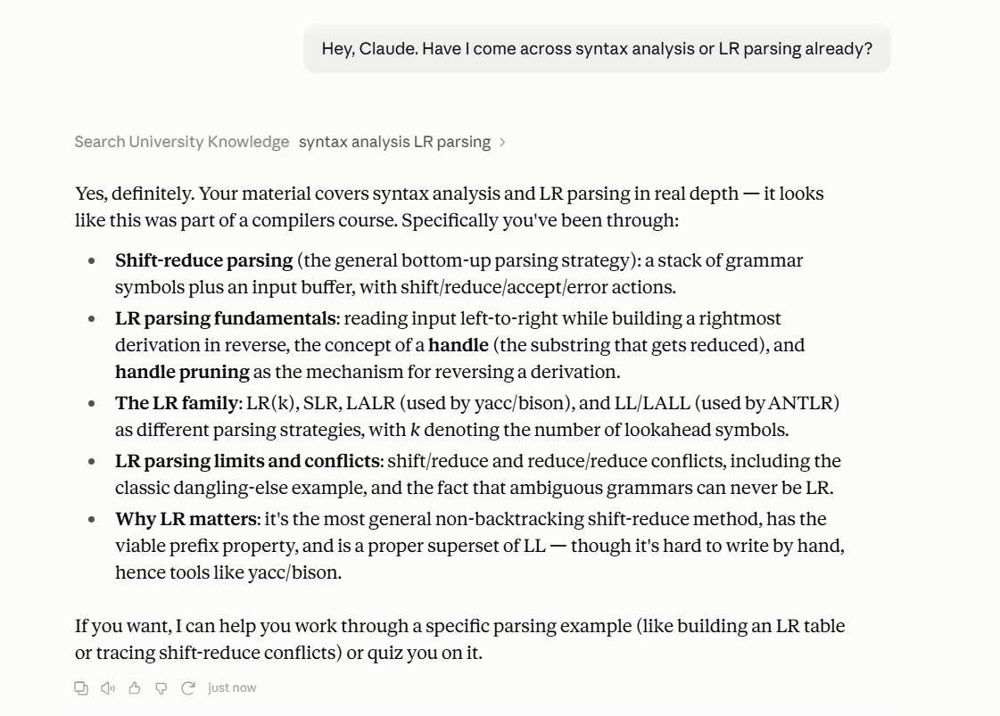

# 🔒 Private PDF RAG

> Turn a folder of PDFs into a searchable knowledge base — without handing
> over the documents, embeddings, or API keys.

**Private PDF RAG** is a lightweight Retrieval-Augmented Generation (RAG)
server for asking natural-language questions about a local PDF collection. It
extracts text, builds a local ChromaDB vector index, retrieves the most useful
pages, and exposes the workflow as an MCP tool for AI assistants.

```text
  Your PDFs 🔐  →  Text extraction  →  Local embeddings  →  ChromaDB  →  Answers ✨
       │                                                                  │
       └────────────────────── stays on your machine ────────────────────┘
```

## Why it is useful

- **Privacy by default** — source PDFs, vector embeddings, local databases,
  API keys, and environments are excluded from Git.
- **Bring your own documents** — add any PDF collection to `data/` and build
  an index locally.
- **Lightweight but capable** — uses `all-MiniLM-L6-v2` embeddings and only
  loads the cross-encoder reranker when a query has enough candidate matches.
- **Smarter retrieval** — retrieves up to 25 semantic candidates, filters weak
  results by cosine distance, then reranks the best matches when needed.
- **Assistant-ready** — FastMCP, LangGraph, LangChain, and Pydantic provide a
  structured tool interface for an MCP-compatible AI client.

## How it works

1. Add PDFs locally to `data/`.
2. `PyMuPDF` extracts text from each non-empty page.
3. ChromaDB stores page embeddings locally, with source filename and page
   number as metadata.
4. A question is structured with LangGraph and Pydantic before retrieval.
5. The retriever returns relevant passages, using a lightweight reranker for
   larger result sets.

## Quick start

### 1. Set up your local key

```powershell
Copy-Item .env.example .env
```

Open `.env` and replace the placeholder with your own Groq API key. Keep this
file private.

### 2. Install dependencies

```powershell
uv sync
```

### 3. Add and index PDFs

Place PDFs in `data/`, then run:

```powershell
uv run python Database/embedding_pipeline.py
```

### 4. Connect an MCP client

Connect an MCP-compatible client to `abstraction.py`. It exposes the
`search_private_documents` tool, which accepts a natural-language question and
returns relevant local passages.

## Example questions

```text
What is lexical analysis, and why is it important in a compiler?
Explain the difference between parsing and lexical analysis.
What is a context-free grammar?
```

## 🎥 Demo

Watch the project in action: [Private PDF RAG walkthrough on YouTube](https://youtu.be/wny1sOKOeA8)

The screenshots below show the MCP tool returning a useful, grounded answer
when relevant material exists—and clearly reporting when it does not.

| No relevant result | Relevant retrieval |
| --- | --- |
|  |  |

## Validation

The repository includes synthetic tests that can be run without any private
PDFs:

```powershell
uv run python Database/chroma_threshold_test.py
uv run python Database/embedding_test.py
```

- `chroma_threshold_test.py` exercises cosine-distance threshold behaviour
  against direct, borderline, and unrelated passages.
- `embedding_test.py` uses a small synthetic fruit corpus to demonstrate
  semantic retrieval and cross-encoder reranking.

## Check out the demo for the retriever

**Note:** This is just the retriever, the real use of this MCP server is when it is connected to a LLM, check out the video for its full capabilities!

## Privacy promise

This repository is intentionally **code-only**.

| Kept local | Included in GitHub |
| --- | --- |
| Your PDFs in `data/*.pdf` | Application source code |
| ChromaDB embeddings | Setup instructions |
| `.env` and API keys | `.env.example` only |
| Virtual environments and caches | Dependency definitions |

Before publishing, run `git status --ignored` and make sure your PDFs, `.env`,
and `Database/chroma_db/` appear only as ignored files. If a real API key has
ever been shared or committed, revoke it and generate a replacement.

## Tech stack

`Python` · `ChromaDB` · `PyMuPDF` · `Sentence Transformers` · `CrossEncoder`
· `LangGraph` · `LangChain` · `FastMCP` · `Pydantic` · `Groq` · `uv`

## Project status

Built as a hackathon project and tested locally on a private PDF collection:
**25 PDFs indexed into 252 searchable page chunks.**

---

Built for useful answers, private data, and fewer “where did I save that PDF?”
moments.
